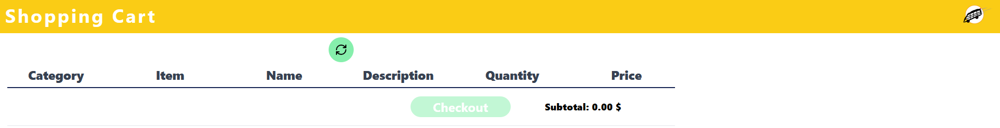
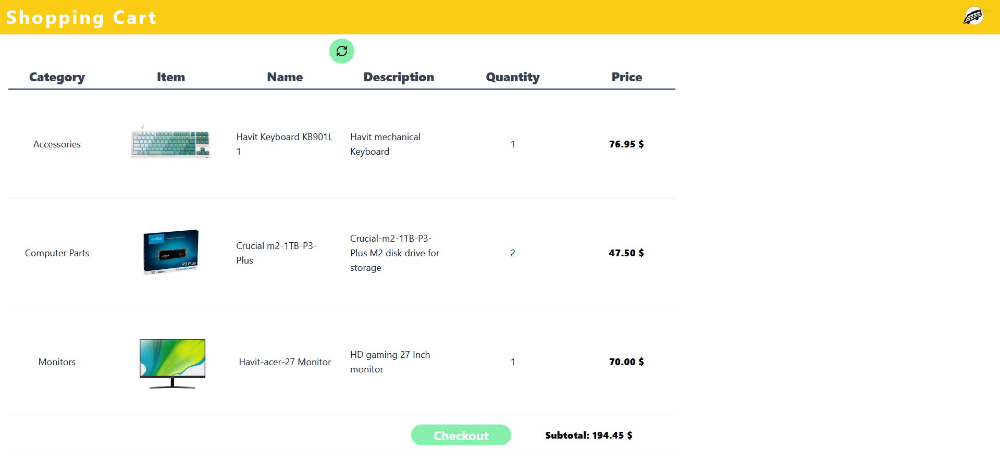
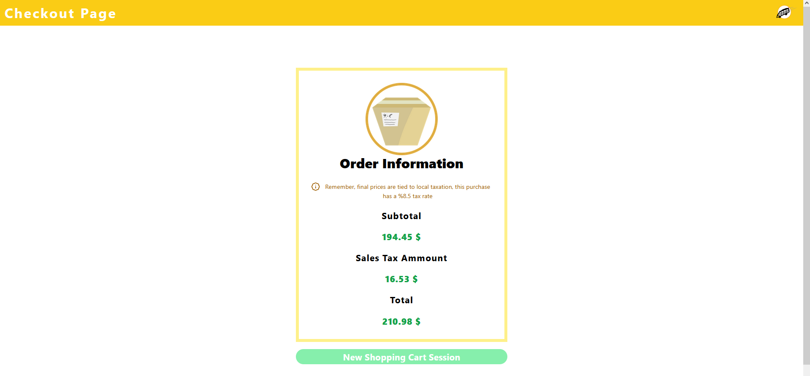

# Highspring Shopping Cart Frontend

React Frontend UI for a simple Shopping Cart project, you can visualize, items details, quantities and checkout orders to see their subtotal and total values

## Instructions

The link to access the UI can be found bellow.

> localhost:5173/ShoppingCart

Once in the application, you can add items through the add orderItem endpoint, for more information visit the swagger documeantation in the [Backend Repositroy]("https://github.com/KelpieLW/Highspring-Shopping-Cart-App").

- All the items added to the shopping cart can be seen after refreshing the page in the refresh button.
  
- All the item details: picture, name, description, quantity and price (discount applied) are available in the ShoppingCart page.
  
- The subtotal of your shopping cart can be seen under your products list.
- You can perform a checkout of your items pressing the "Checkout" button, this will create the order and redirect you to the "Checkout" page.
  
- Total and subtotal values can be seen in the Checkout page, the total is calculated after applying the tax rate over the subtotal value.
  
- You can restart the shopping cart and return to the first ShoppingCart page by pressing the "New Shopping Cart Session" button.
